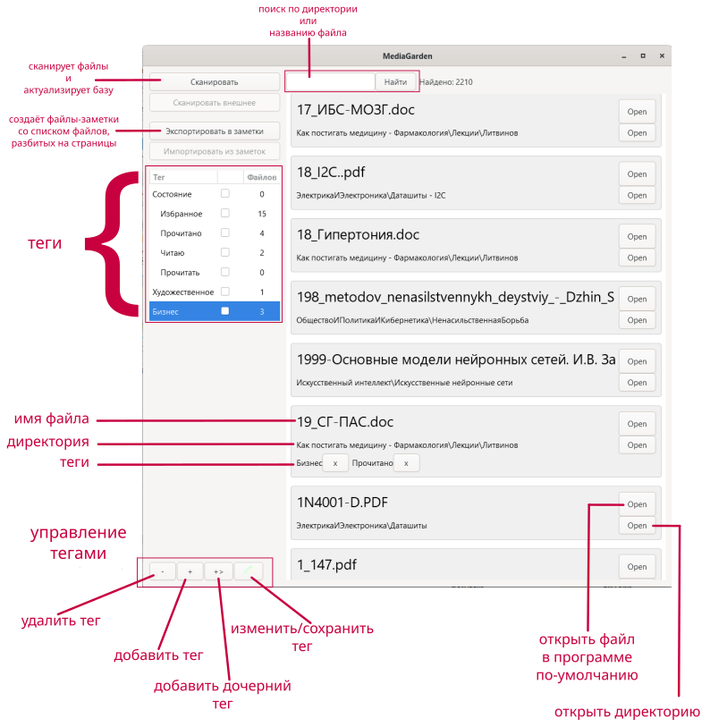
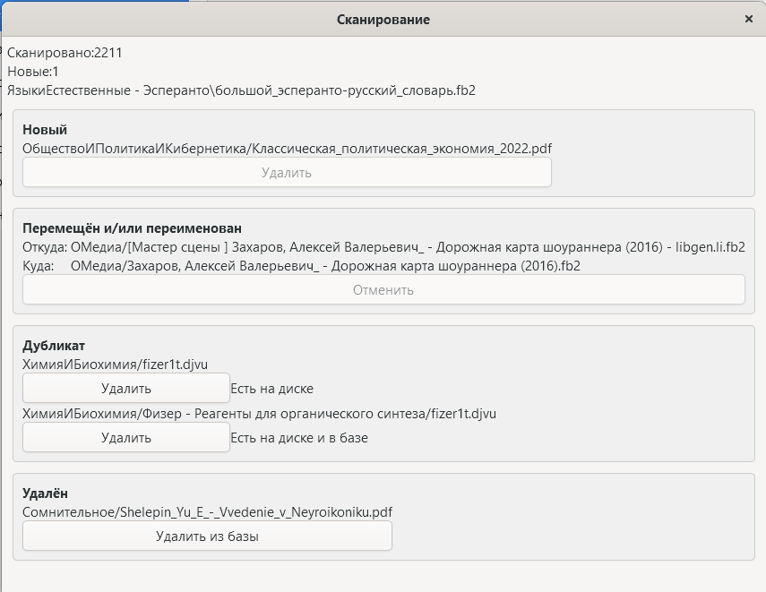

# MediaGarden - Сканер хранилища книг

Минимальная версия Python: 3.12

## Преимущества

1. Не меняет структуру файлов и не копирует их
2. Переименовывайте и перемещайте файлы, добавлять новые и удалять старые. Затем зайдите в Программу и запустите сканирование - это обновит базу.
3. Экспорт постраничного списка книг в хранилище заметок. Открывайте список в приложении заметок: делайте заметки к книгам, пишите изложения и рецензии.
4. Помечайте книги тегами, фильтруйте по тегам.

## Главное окно

Чтобы прикрепить тег к файлу - зажмите тег на имени и перетащите его на карточку файла.

Кнопка редактирования тега удалена. Вместо неё используйте:
- double-click по имени тега - переименование тега. Для применения изменений - нажмите Enter.

При двойном щелчке по названию книги - откроется окошко, в котором будет кнопка для открытия заметки о книге. Если заметки нет, то будет кнопка создания заметки.

## Окно сканирования

При сканировании файлов могут появится 4 варианта карточек, сообщающие об изменениях в структре файлов, например, если вы что меняли вручную.

Программа допускает, что Вы можете переименовать файл и/или переместить его в пределах директории хранилища. При этом все привязанные теги останутся по-прежнему привязанными к файлу.

## Особенности поведения

1. Удалённые с диска файлы удаляются из базы данных. При добавлении вновь он изменит свой идентификатор, что сделает в заметках ссылки на него невалидными.
2. Если изменить файл, то он воспримется как новый, а файл с хешем старой версии будет считаться удалённой, оставаясь при этом в базе.
3. Поиск кириллических символов - регистрозависимый, латинских - регистронезависимый.
4. После завершения сканирования программа сообщит об этом в консоль.
5. Программа создаёт в директории заметок директорию `книги_список_всех`, в которой может создавать список книг и заметки о книгах.